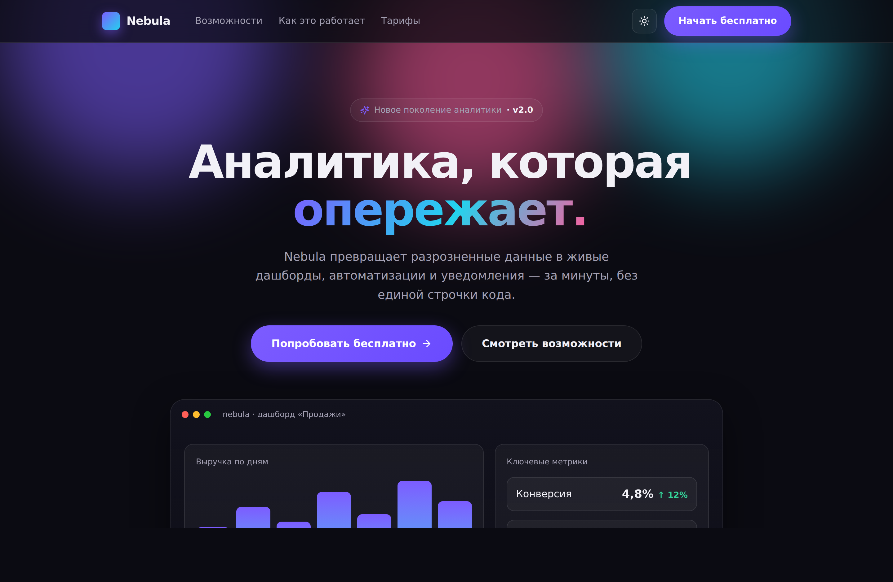
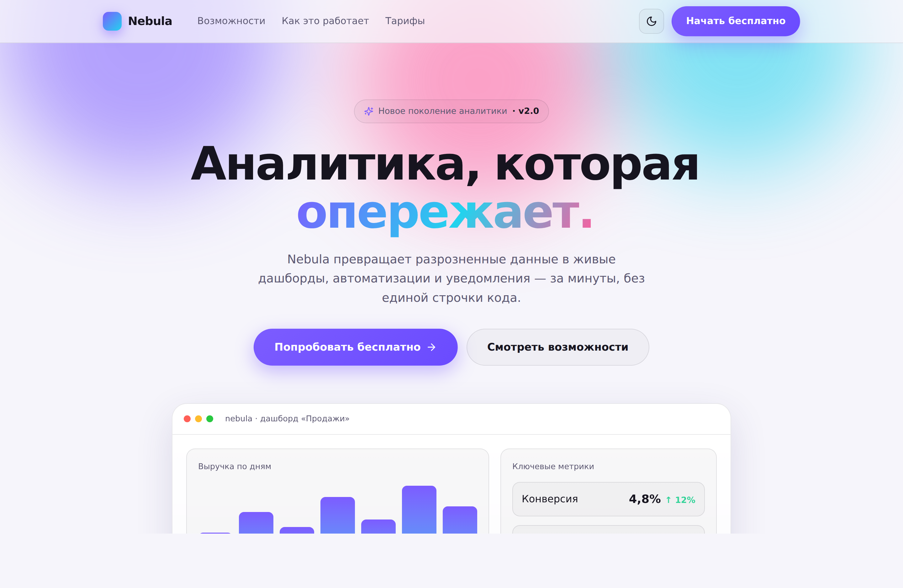

# Nebula — анимированный лендинг на React

Демонстрационный одностраничный лендинг вымышленного сервиса аналитики.
Показывает связку **React + Vite + Framer Motion**: плавные анимации появления
по скроллу, анимированные счётчики, интерактивные карточки, тёмная/светлая тема
и полная адаптивность.



## Что показано

- **Анимации на Framer Motion:** появление блоков по скроллу, стаггер-анимация
  заголовка, «плавающий» макет дашборда, анимированные столбцы графика.
- **Анимированные счётчики** — цифры статистики набегают при попадании в экран.
- **Тёмная и светлая тема** — переключается в один клик, выбор сохраняется.
- **Интерактив:** карточки возможностей с реакцией на наведение, индикатор
  прогресса скролла, «стеклянная» навигация с размытием.
- **Адаптив** — аккуратно ложится на телефоны и планшеты.
- **Доступность:** при системной настройке «уменьшить движение»
  (`prefers-reduced-motion`) анимации отключаются, контент показывается сразу.

## Стек

React 18 · Vite · Framer Motion · lucide-react · чистый CSS (переменные, без UI-китов)

## Запуск

```bash
npm install
npm run dev       # http://localhost:5173 — режим разработки
```

Сборка продакшен-версии:

```bash
npm run build     # готовые файлы в dist/
npm run preview   # локальный предпросмотр сборки
```

## Галерея

| Тёмная тема | Светлая тема |
|-------------|--------------|
|  |  |

Полная страница целиком — [`assets/full-page.png`](assets/full-page.png).

## Структура

```
index.html         — точка входа, тема выставляется до отрисовки (без мигания)
src/
  main.jsx         — монтирование React
  App.jsx          — весь лендинг: секции, анимации, переключатель темы
  styles.css       — дизайн-система на CSS-переменных, тёмная/светлая тема
vite.config.js     — сборка (относительные пути — открывается где угодно)
```

Контент вымышленный, под реальный проект меняются тексты, секции и палитра
(все цвета вынесены в CSS-переменные в начале `styles.css`).

## Лицензия

MIT — см. [LICENSE](LICENSE).
